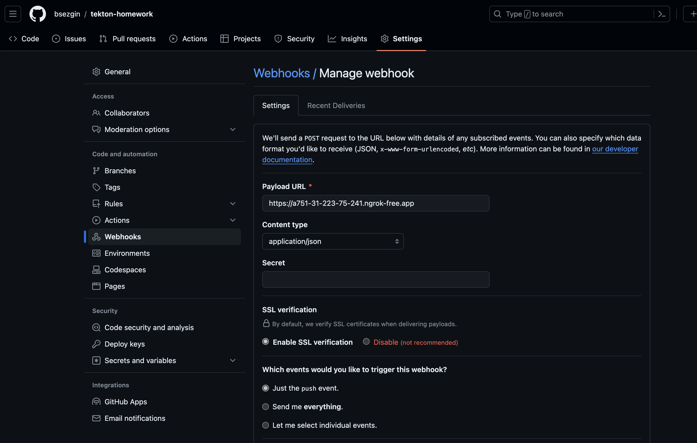

## Tekton CI/CD homework

The purpose of this homework is an assesment for setting up and managing cloud-native CI/CD pipelines with using Tekton Pipelines, Local Kubernetes setup (Minikube) and a git repository on Github.

## 1. Kubernetes Cluster Setup

This guide will walk you through the process of setting up a local Kubernetes cluster using Minikube on a Mac Computer.

### Prerequisites for Kubernetes

- Install [Docker](https://docs.docker.com/desktop/install/mac-install/) on your local machine.
- Install [VirtualBox](https://www.virtualbox.org/wiki/Downloads) or any other driver that Minikube supports.
- Install [kubectl](https://kubernetes.io/docs/tasks/tools/install-kubectl-macos/), the Kubernetes command-line tool.
- Install [Minikube](https://minikube.sigs.k8s.io/docs/start/).

### Steps

1. **Installation**

    ```bash
        curl -LO https://storage.googleapis.com/minikube/releases/latest/minikube-darwin-amd64
        sudo install minikube-darwin-amd64 /usr/local/bin/minikube 
2. **Start Minikube**

   Start a local Kubernetes cluster with Minikube using the following command:

   ```bash
    minikube start
    ```
    This command creates and configures a Virtual Machine that runs a single-node Kubernetes cluster.

3. **Check Cluster Status**

   You can check the status of your cluster at any time using the following command:

   ```bash
   minikube status
    ```

   This should return a message indicating that Minikube is running.

## 2. Tekton Pipelines Setup

### Installation Steps

1. **Apply the Tekton Pipelines CRDs to the Kubernetes cluster**    
    Note: You must have a Kubernetes cluster running version 1.15.0 or later.    
    Run the following command to apply the Tekton Pipelines with the latest official release:

   ```bash
   kubectl apply --filename https://storage.googleapis.com/tekton-releases/pipeline/latest/release.yaml
   ```

   Check the kubernetes cluster to see the tekton pipelines has been installed with the following command

   ```bash
   kubectl get ns
   ```
   Make sure that **tekton-pipelines** namespace and its resources has been created

2. **Install the Tekton Dashboard**

    Note: You must have a Kubernetes cluster running version 1.24.0 or later.  
    Run the following command to install Tekton Dashboard:

    ```bash
   kubectl apply --filename https://storage.googleapis.com/tekton-releases/dashboard/latest/release.yaml
   ```
    Check the kubernetes cluster to see the tekton pipelines has been installed with the following command

   ```bash
   kubectl get ns
   ```
   Make sure that **tekton-dashboard** namespace and its resources has been created

3. **Install the Tekton Triggers**

    Note: You must have a Kubernetes cluster running version 1.18.0 or later.  
    Run the following command to install Tekton Triggers:

    ```bash
    kubectl apply --filename https://storage.googleapis.com/tekton-releases/triggers/latest/release.yaml
    kubectl apply --filename https://storage.googleapis.com/tekton-releases/triggers/latest/interceptors.yaml
    ```

4. **Tekton CLI installation**

Use the following command to install Tekton CLI

    brew install tektoncd-cli


## 3. Github Setup for Tekton Triggers

Open a shell window. Create a directory called **tekton-homework**. Create the main.go and Dockerfile in the following in the directory **tekton-homework**..  
**main.go**  

        package main
        import (
        	"fmt"
        	"net/http"
        )
        func main() {
        	http.HandleFunc("/", HelloWorld)
        	http.ListenAndServe(":8080", nil)
        }
        func HelloWorld(w http.ResponseWriter, r *http.Request) {
        	fmt.Fprintf(w, "Hello World")
        }


**Dockerfile** 

        FROM golang:1.14.2-alpine AS build
        COPY main.go .
        RUN CGO_ENABLED=0 GOOS=linux go build -a -installsuffix cgo -o app .
        FROM scratch
        COPY --from=build /go/app /bin/
        EXPOSE 8080
        CMD ["app"]


 Use git init to create the git repo for the project and push it to the Github.  
 I've created a repo for the project **https://github.com/bsezgin/tekton-homework.git**


## 4. Tekton pipeline for the project

The Pipeline consists of 5 steps:  
        - Git Fetch  
        - Build Go code  
        - Create Docker image with kaniko and push it to Docker registry  
        - Use trivy to scan the image against vulnerabilities  
        - Deploy the Docker image to kubernetes  

We need to create the tasks for these steps:

**Git-Clone Task**
I've used the default git task that can be found on tekton hub : https://hub.tekton.dev/tekton/task/git-clone  
To install the task use the following command: 

    tkn hub install task git-clone

**Kaniko Docker Build and Push Task**

I've used the default kaniko task that can be found on tekton hub : https://hub.tekton.dev/tekton/task/kaniko  
To install the task use the following command: 

    tkn hub install task kaniko

**Kubernetes Deploy Task**

I've used the default kaniko task that can be found on tekton hub : https://hub.tekton.dev/tekton/task/kubernetes-actions  
To install the task use the following command:

    tkn hub install task kubernetes-actions

**Trivy Scan Docker Image Task**

I've used the custom kaniko tasks. Please find the task in the following:

        apiVersion: tekton.dev/v1beta1
        kind: Task
        metadata:
          name: trivy
        spec:
          params:
          - name: imageName
            type: string
          steps:
          - name: scan
            image: aquasec/trivy:latest
            script: |
              SCAN_RESULT=$(trivy image --severity CRITICAL --exit-code 1 --quiet $(params.imageName))
              if [ $? -ne 0 ]; then
                echo "Critical vulnerability found!"
                exit 1
              fi

I've created a Pipeline YAML with adding these tasks. 

Pipeline YAML has these features:

**Main Parameters:**  
-Git Repo URL  
-Image reference for the Docker Image  
Main Volumes  
-Volume for Git Repo  
-Kubernetes Secret for Docker Registry  
Note: I didn't create a git hub credentials since i've used a public repo for the project.

**Tasks**
- 1. **Git Clone task:**
This task has one workspace called output and it is using the volume shared-data. Purpose of this task is cloning the git repo that specified in the PipelineRun. 
- 2. **Get git commit hash Task:**
This task is using the one workspace has source and it is using the volume shared-data.
Purpose of this task is getting the commit has from the git push to label the docker image with that specific push. It is exposing this information with an output variable called SHA. It has been set to run after the git clone task with runAfter condition.
Please find the Trivy task YAML file in the following link:

            https://github.com/bsezgin/tekton-homework/tree/main/tekton-pipelines/git-commit-hash-task.yml
- 3. **Kaniko Task:**
Kaniko is building the docker image without using Docker Engine.This task is using two workspace source and docker credentials. Source is the volume to pull the docker image and the docker-credentials is a kubernetes secret to push the image that build by kaniko task.It has been set to run after the git commit hash task with runAfter condition.
- 4. **Trivy Task**
Trivy is a free Container image scanner task created by AquaSec.This task is using only the docker image tag information to scan the docker image. It has a special condition that if a vulnerability has been found in the image it is stopping the pipeline to avoid the deploy the image that has the vulnerabilities to the kubernetes.It has been set to run after the kaniko task with runAfter condition.
**I need to add additional note there, since a pipeline that has build code and docker images needs to be assesed with DevSecOps tools such trivy that we used for this workshop.  For the code build we can use some static code analyzers such as SonarQube. This can create safer builds.**
Please find the Trivy task YAML file in the following link:

            https://github.com/bsezgin/tekton-homework/tree/main/tekton-pipelines/trivy.yml
- 5. **Kubernetes Deploy**
This  task is deploying the build and scanned Docker image to the kubernetes as Deployment with using kubectl.
I've also created the K8S manifest files(Loas Balancer Service Manifest, Nodeport Service Manifest and Ingress Manifest files that can be found on https://github.com/bsezgin/tekton-homework/tree/main/K8S) to expose the application to the internet.

The whole pipeline.yml file has been found on the https://github.com/bsezgin/tekton-homework/tree/main/tekton-pipelines/pipeline.yml.

**Triggers for Pipeline Runs**

This was the most complex part of the project. First we need to create the Event Listener, Trigger Binding and Triggers YAML files.  I've used the default namespace instead of to create a namespace for the Tekton Triggers in kubernetes.  Also, I've created a service account which has a ClusterRole and a Cluster Role Binding to modify the  Kubernetes resources such as Deployment, CRD etc in all namespaces.

- 1. Event Listener:
Event Listener is created for listening the Github push events. I've used the service account that I've created earlier for the Event Listener.  

- 2. Trigger Binding:

Trigger Binding is used to specify the fields in the event payload from which you want to extract data and the fields in the corresponding TriggerTemplate to populate with the extracted values.  
I've used two paramaters for trigger binding:

- Git Repo URL : This paramater is pointing to my git repo **https://github.com/bsezgin/tekton-homework.git** since we need this info to extract the payload from the github webhook.
- Docker Image Name : This parameters is pointing my Docker image in my Docker Repository.

- 3. Trigger Template:

Specifies a blueprint for the resource, such as PipelineRun, that you want to instantiate and/or execute when your EventListener detects an event.

I've added a Pipeline Run to the trigger template since I'm using a pipeline and I want to automate it on each push.
Also I've used the same service account that i've used in Event Listener for the PipelineRun.

Please find the trigger related resources YAML file in the following link:

            https://github.com/bsezgin/tekton-homework/tree/main/tekton-pipelines/triggers.yml


Pipeline Run has these features:

**Parameters**
It is using two parameters: 

- Git Repo URL : This paramater is pointing to my git repo **https://github.com/bsezgin/tekton-homework.git** since we need this info to extrcct the payload from the github webhook.
- Docker Image Name : This parameters is pointing my Docker image in my Docker Repository.

**Workspace**
It is creating two workspaces as I've discussed in the pipeline YAML.  
1. A volume with ReadWriteOnce access mode with non-root user.
2. Docker Credentials which is kubernetes secret that has been set for the kubernetes cluster to be able to access to the Docker Registry.

**Github Webhook**

Before creating webhook, we need create a connection between github and the minikube. 

1. Start a tunnel in minikube with using the following command in a separate shell.
    ```bash
    minikube tunnel
    ```
2. Download and install the ngrok to your workstation with using brew.
    ```bash
    brew install ngrok/ngrok/ngrok
    ```
3. You need obtain a token from ngrok in order to run it. Obtain it with creating an account in ngrok and add it to your ngrok config file with using the following command
    ```bash
    ngrok config add-authtoken <token>
    ```
4. Now run the following command
    ```bash
    ngrok http http://localhost:8080 
    ```
    This will create a random URL for your local workstation like **https://a751-31-223-75-241.ngrok-free.app**

    We are going to using it in github webhook.  
    

Now, do a push to the github and trigger will automatically handle the event and will run the pipeline.


## 5. Conclusion

1. **Challenges**

Installing Tekton Pipelines and it related resources was very easy but configuring the pipelines was the a real challenge.

- Problem 1: Understanding the logic of Tekton Pipelines such as workspaces. This confused me a lot since i'm familiar with the Azure Devops.
- Problem 2: Architecture of Tekton pipelines. I got confused by the Pipeline, PipelineRun, Task and Task Run
- Problem 3: Creating a docker secret in kubernetes :) I've created it with using kubectl but somehow Minikube has malformed it and i've found the problem with 3 hours of googling it.

2. **Lastwords**

I've learned a lot about Cloud Native Tekton pipelines and automate it in cloud native environment. The workshop has some chalenges and problems but overall it was very fun to complete it.